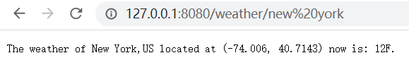
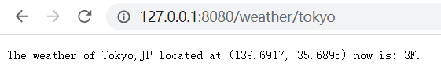
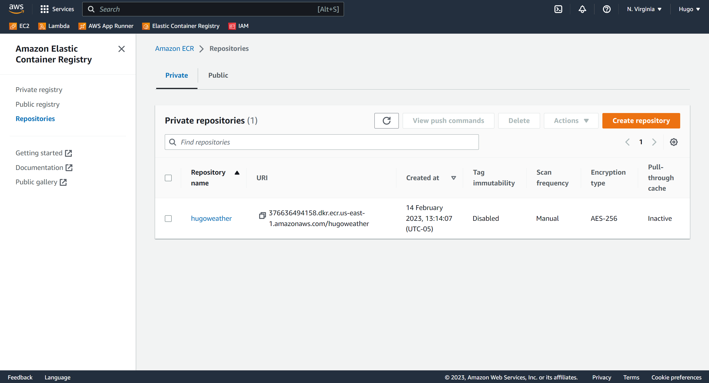

## Introduction
In this project 2, I will try to learn docker and possibly Kubernetes (K8S) for Rust-based microservice.

This app parses user's input of a city name, and returns the real-time weather using OpenWeather API.

### 1. Containerized Actix Microservice

**Change** docker file if you need:

```dockerfile
FROM rust:latest as builder
ENV APP hugoweather
WORKDIR /usr/src/$APP
COPY . .
RUN cargo install --path .
 
FROM debian:buster-slim
RUN apt-get update && rm -rf /var/lib/apt/lists/*
COPY --from=builder /usr/local/cargo/bin/$APP /usr/local/bin/$APP
#export this actix web service to port 8080 and 0.0.0.0
EXPOSE 8080
CMD ["hugoweather"]
```

### 2. Configure OpenWeather API

Though I keeped my api_key in the code, please **DO NOT USE IT!**

Register your account, and get your own **FREE** api_key [here](https://openweathermap.org/).

**Replace** "url2" in lib.rs with your own's:
```rust
// Get response from weather api
async fn get_response(location: &str) -> JsonValue {
    let url1 = "http://api.openweathermap.org/data/2.5/weather?q=";
    let url2 = "&appid=1f565f89dbe934dc5916a2cc3f943d76"; // Replace this
    let url = [url1, location, url2].concat();
    let resp = reqwest::get(&url).await.unwrap().text().await.unwrap();
    json::parse(&resp).unwrap()
}
```

### 3. Local Deployment
**Build** docker image and run it:

```bash
docker build -t hugoweather . 
docker run -it --rm -p 8080:8080 hugoweather
```

**Open** your broswer and visit: http://127.0.0.1:8080/

You are expected to see this welcome page:





</br>

## Push to AWS ECR
### 1. Prerequisites

- **Docker is properly installed and running**
- **You have created an AWS account**

### 2. Configure ECR

**Create** a new blank ECR image in your AWS dashboard: [AWS ECR](https://us-east-1.console.aws.amazon.com/ecr)

**Create** a new access key in your AWS IAM dashboard: [AWS IAM](https://us-east-1.console.aws.amazon.com/iamv2)

You need also **grant sufficient permissions** to the key. See this article if you meet any problems: [Help](https://www.freecodecamp.org/news/build-and-push-docker-images-to-aws-ecr/)

**Install** AWS CLI:
```bash
sudo apt-get install awscli
```

**Configure** your local credentials:
```bash
aws configure
# enter your access key and secrets, select default region: us-east-1
```

**Retrieve** an authentication token and authenticate your Docker client to your registry.
```
aws ecr get-login-password --region us-east-1 | docker login --username AWS --password-stdin YOUR_ECR_ID.dkr.ecr.us-east-1.amazonaws.com
# replace YOUR_ECR_ID with your image url
```

**Tag** your image so you can push the image to this repository.
```bash
docker tag hugoweather:latest YOUR_ECR_ID.dkr.ecr.us-east-1.amazonaws.com/hugoweather:latest
# replace YOUR_ECR_ID with your image url
```

**Run** the following command to push this image to your newly created AWS repository:
```bash
docker push YOUR_ECR_ID.dkr.ecr.us-east-1.amazonaws.com/hugoweather:latest
# replace YOUR_ECR_ID with your image url
```



</br>

## Publish to AWS App Runner

**Create** a new App Runner service: [AWS APP Runner](https://us-east-1.console.aws.amazon.com/apprunner) 

**Select** the image you built, and choose **Auto Deploy**.

**Wait** until health check is automatically completed.


