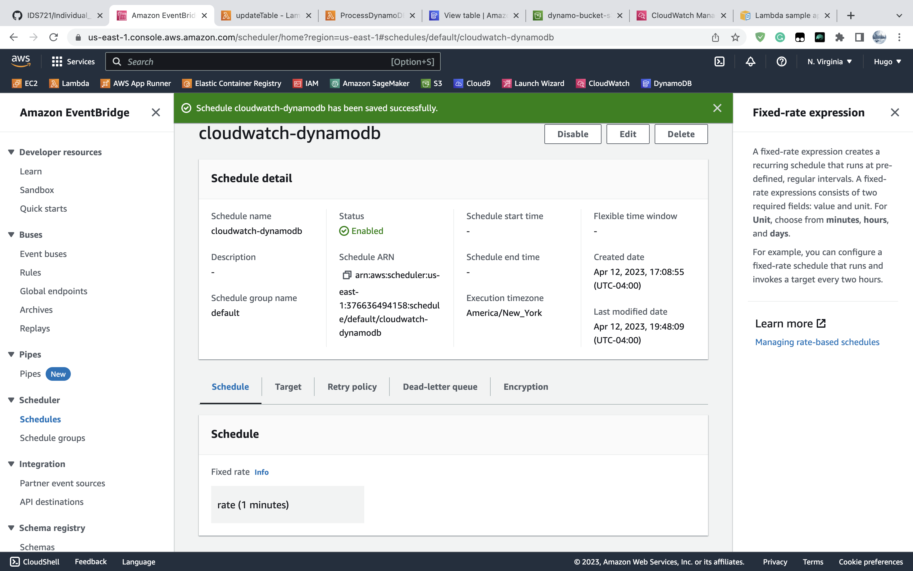
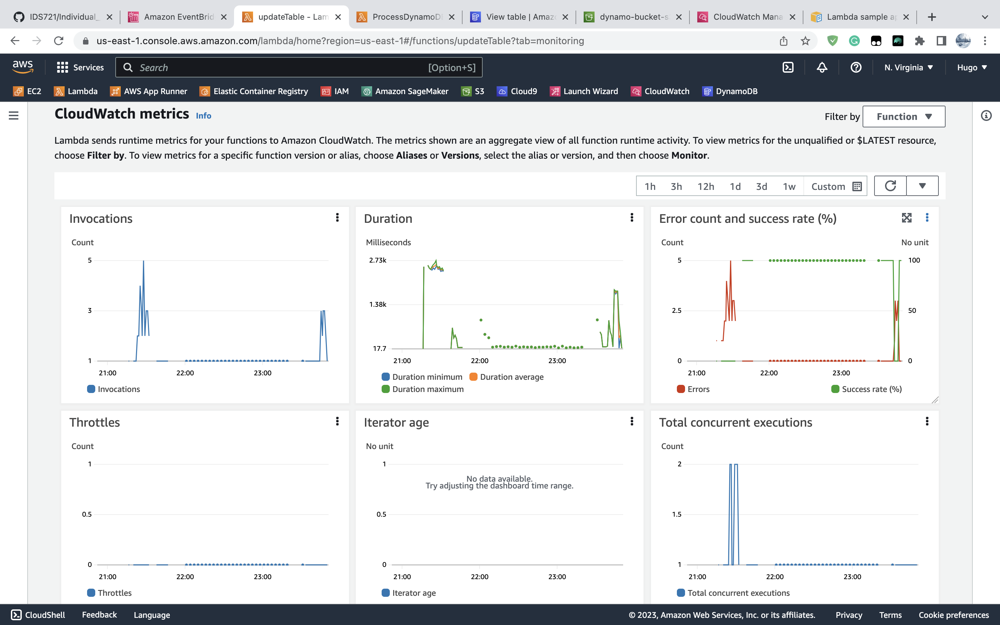
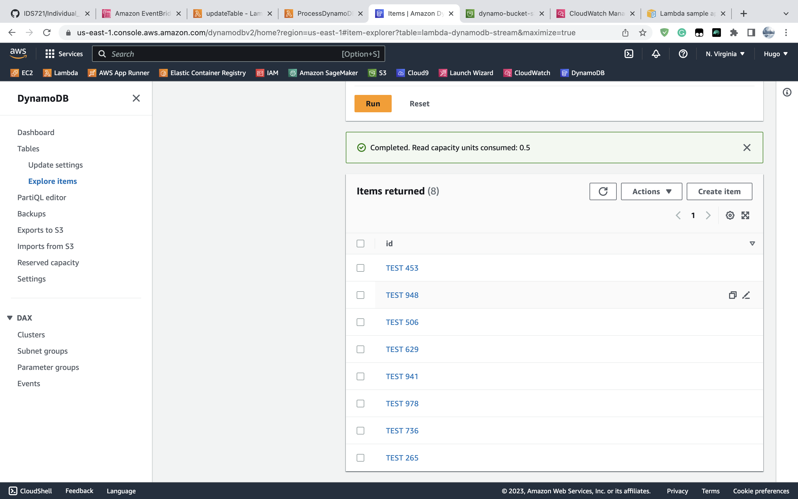
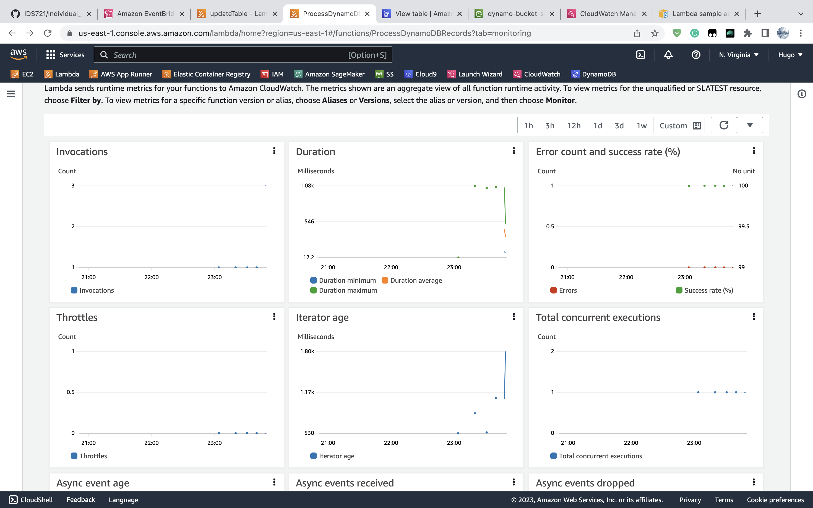
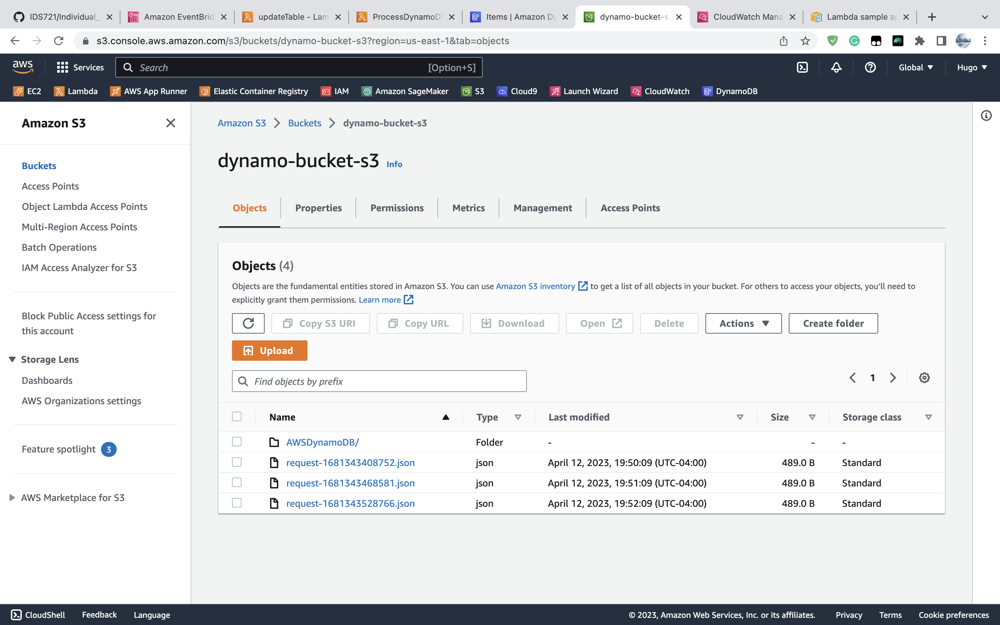

# Individual Project 4

## Introduction

In this project, I learn how to use serverless service. I plan to build an end-to-end pipeline as below:


## Week 9

The first week, I learned AWS Lambda by created a javascript function to return the status of a reponse.


Then I mannually test this function by created an ```input.txt``` to mock the action stream going out from DynamoDB:

```txt
{
   "Records":[
      {
         "eventID":"1",
         "eventName":"INSERT",
         "eventVersion":"1.0",
         "eventSource":"aws:dynamodb",
         "awsRegion":"us-east-1",
         "dynamodb":{
            "Keys":{
               "Id":{
                  "N":"101"
               }
            },
            "NewImage":{
               "Message":{
                  "S":"New item!"
               },
               "Id":{
                  "N":"101"
               }
            },
            "SequenceNumber":"111",
            "SizeBytes":26,
            "StreamViewType":"NEW_AND_OLD_IMAGES"
         },
         "eventSourceARN":"stream-ARN"
      },
      ...
   ]
}
```

Finally I called this lambda function in the AWS Shell, the output returns a status code of 200, which indicates correction.

.png)

.png)

<br/>

## Week 10

In this second week, I learned how to add a event triger to the AWS DynamoDB. 


That once the DynamoDB adds, updates, and deletes items to the table, DynamoDB writes records of these actions to the stream.


AWS Lambda then polls the stream and when it detects updates to the stream, it invokes the Lambda function by passing in the event data it finds in the stream.

The function runs and creates logs in Amazon CloudWatch. It is verified the logs reported in the Amazon CloudWatch console.


## Week 11

This week, I completed the workflow above.

Firstly, I setup an Amazon EventBridge, that invokes the ```updateTable``` lambda 1 time per minute.



Then, I create implemented the ```updateTable``` lambda function:

```js
// Import the required AWS SDK clients
const AWS = require('aws-sdk');
const dynamoDB = new AWS.DynamoDB.DocumentClient();

// Define the name of the DynamoDB table
const tableName = "lambda-dynamodb-stream";

exports.handler = async (event, context) => {
  try {
    // Define the item to be put into the table
    const item = {
      id: 'TEST ' + Math.floor(Math.random() * 1000)
    };

    // Define the DynamoDB put parameters
    const params = {
      TableName: tableName,
      Item: item
    };

    // Put the item into the DynamoDB table
    await dynamoDB.put(params).promise();

    // Return a successful response
    return {
      statusCode: 200,
      body: JSON.stringify({ message: 'Item added to the table successfully.' })
    };
  } catch (error) {
    console.error(`Error putting item into table: ${error.message}`);
    return {
      statusCode: 500,
      body: JSON.stringify({ message: 'Error putting item into table.' })
    };
  }
};
```

It tries to **insert** a random id into the table in ```DynamoDB``` database.





Thirdly, with the implementations from past two weeks, whenever the database changes, it outputs a stream to another lambda function ```ProcessDynamoDBRecords```, which then write the records to the ```S3 Bucket```.

```js
console.log('Loading function');

const AWS = require('aws-sdk');
const s3 = new AWS.S3();

exports.handler = async (event, context) => {
	console.log(JSON.stringify(event, null, 2));
    event.Records.forEach(function(record) {
        console.log(record.eventID);
        console.log(record.eventName);
        console.log('DynamoDB Record: %j', record.dynamodb);
    });
	  
	    
  try {
    // Set the bucket name and an object key using the current timestamp
    const bucketName = 'dynamo-bucket-s3'; // Replace with your S3 bucket name
    const objectKey = `request-${Date.now()}.json`;

    // Prepare the S3 putObject parameters
    const params = {
      Bucket: bucketName,
      Key: objectKey,
      Body: JSON.stringify(event),
      ContentType: 'application/json',
    };

    // Upload the JSON event data to S3
    await s3.putObject(params).promise();

    // Return a successful response
    return {
      statusCode: 200,
      body: JSON.stringify({
        message: 'Request saved to S3 successfully.',
        objectKey: objectKey,
      }),
    };
  } catch (error) {
    // Log the error and return an error response
    console.error('Error saving request to S3:', error);
    return {
      statusCode: 500,
      body: JSON.stringify({
        message: 'An error occurred while saving the request to S3.',
        error: error.message,
      }),
    };
  }
};
```


Finally, we can observe the output file in ```S3 Bucket```.




