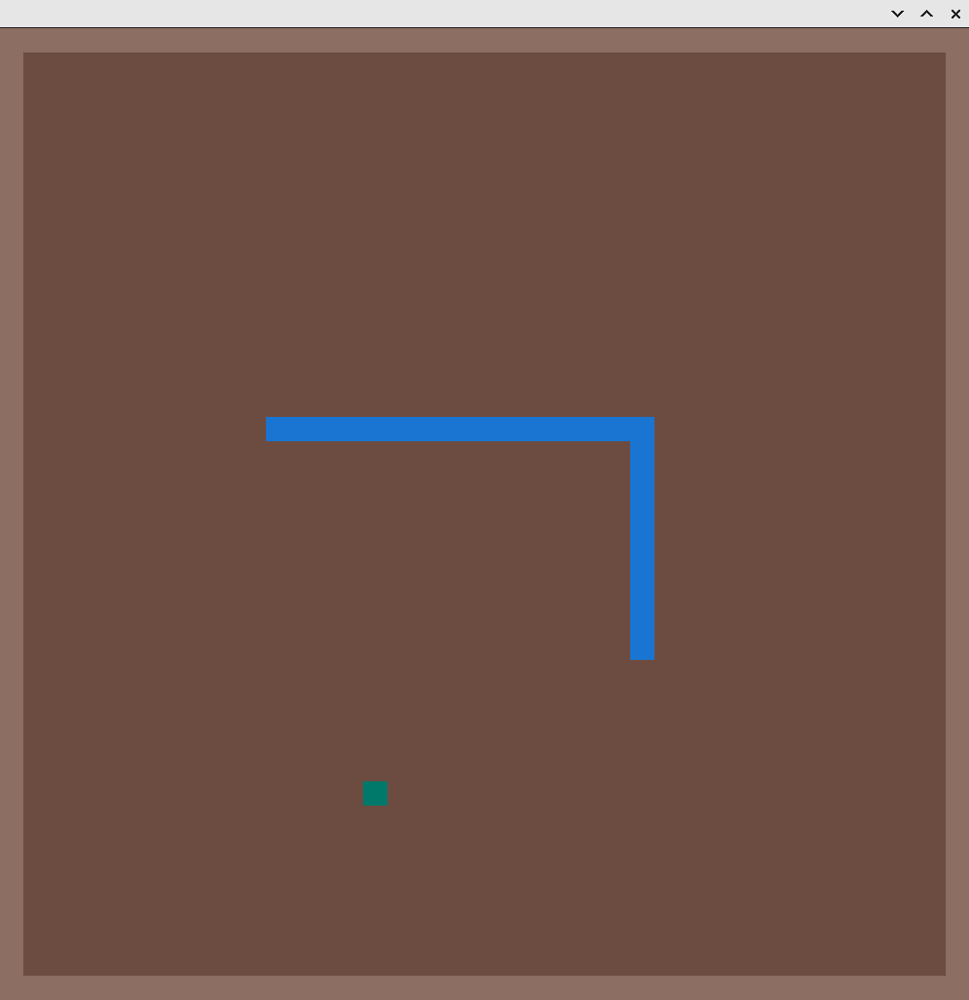

## Week 10 Demo

### Introduction

In this Demo, I adapted a snake-game by modified the game speed, the color of snake, food, and background, and the rule (now eating a food increases its length by 2 instead of 1).

I learned how to use the library ```piston_window``` to draw rectangles on a canvas in Linux desktop application, as well as the event-driven game design pattern.

### Usage

```sh
cargo run all
```




