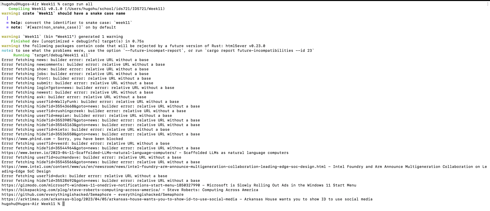

## Week 11 Demo

### Introduction

In this Demo, I write an advanced Rust application for multi-threaded web scraper that extracts the titles of articles from a website using the ```reqwest```, ```select```, and ```tokio``` crates. 

It demonstrates asynchronous programming, error handling, and concurrent web requests.

### Usage

```sh
cargo run all
```




